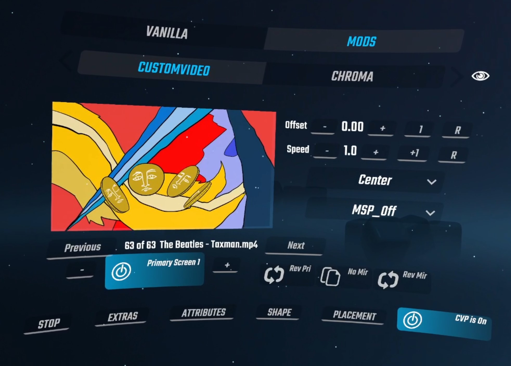
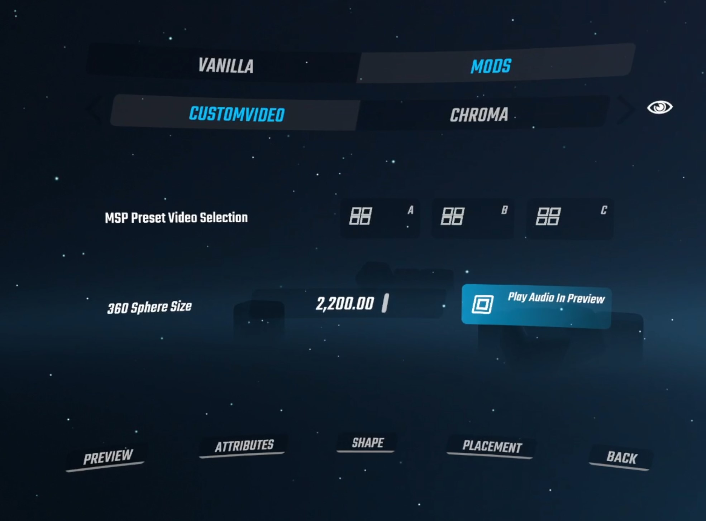
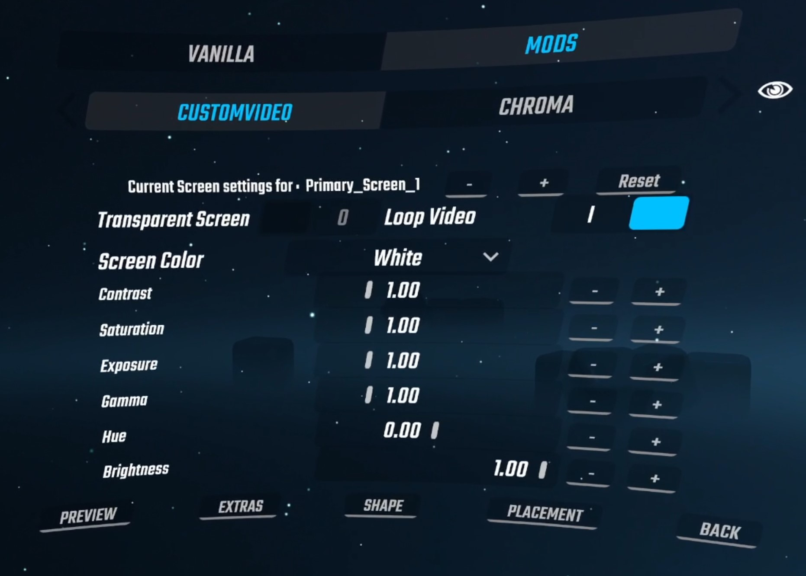
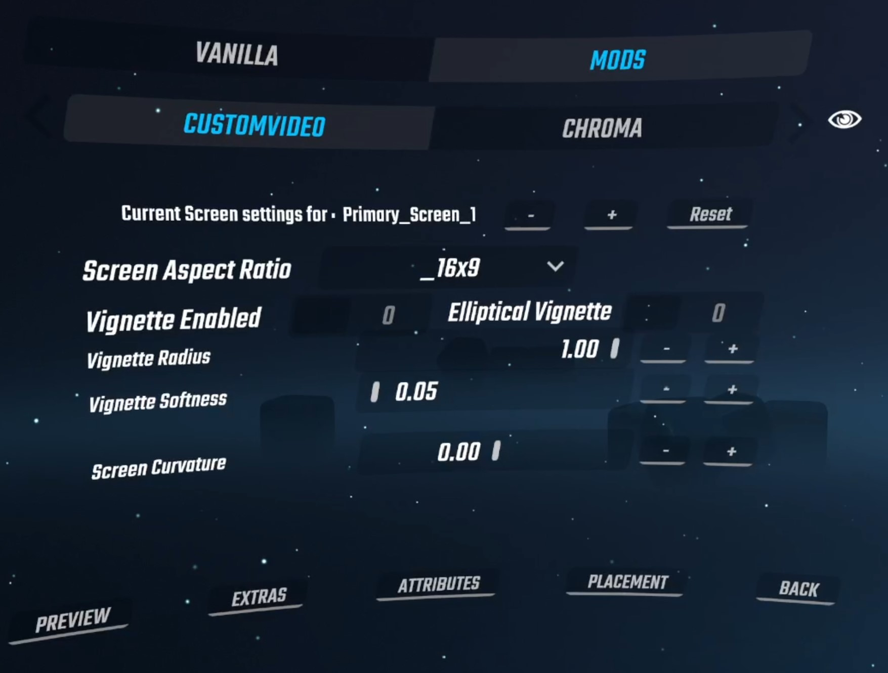
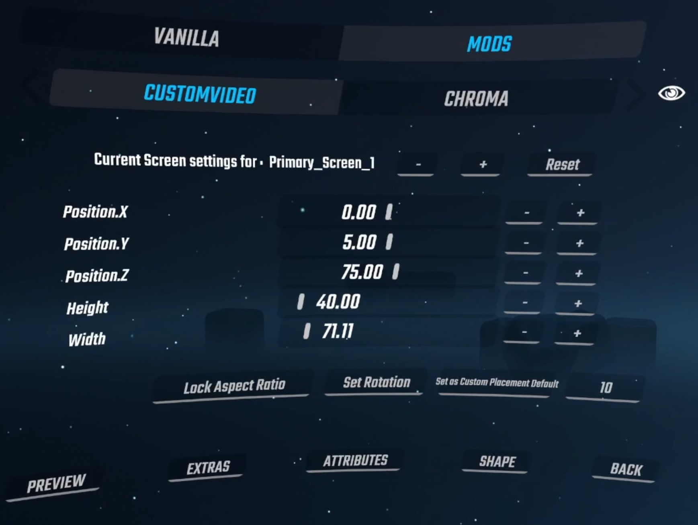

**What this is**

* CustomVideoPlayer is a Beat Saber addon created from a fork of the original MusicVideoPlayer mod.  It can work independently and alongside BeatSaberCinema.
* It plays videos from a CustomVideos directory.  The benefits of this mod improve as one collects more videos and discovers creative ways to layer them or let them interact with the platform.

**Features**

* 6 primary screens: Play up to 6 videos anywhere in the game environment.
* 3 360 screens:  Play up to 3 equirectangular 360 videos.
* 3 MSP (Multi Screen Placement) presets.  Several screens can be configured using the parameters associated with a single screen.  A UI dropdown list is used to select from several preset screen arrangements. 

**Screen Options**

- Enable/disable screen transparency. 
- Adjust video playback start time.
- Adjust video playback speed.
- Alter video color characteristics. (Saturation, Contrast, Exposure, Hue, Gamma, Brightness.)
- Adjust screen shape.  This includes screen curvature, vignetting and aspect ratio.
- Screen placement:  The user can choose from a list of standard locations and then make further modifications to screen position, rotation and scale.
- Screen mirroring:  Each of the 6 primary screens can be cloned and then mimicked across a given axis.  This makes it easy to set up two screens with duplicate color and shape attributes.
- Screen image reversal: Each of the primary screens as well as its mirror can have their images reversed.  This allows the user more flexibility and improve scene symmetry.
- Custom screen placement:  One user defined screen placement can be saved between sessions and is configurable in CustomVideoPlayer.ini.

**Things Missing**

* Youtube download functionality.  
* Ability to delete videos.

**Mod Requirements:**

Video files must be provided by the user and installed in the following directories:

    Beat Saber/CustomVideos
    Beat Saber/CustomVideos/360
    Beat Saber/CustomVideos/VideoSets    (Optional)

Videos must have an .mp4 extension.  Other extensions (.mkv, .mov, avi) will not be recognized.

**Prerequisite Mods:**

    BS Utils v1.12.2
    BeatSaberMarkupLanguage: v1.6.10
    BSIPA: v4.2.2
	SongCore v3.10.2

**Installing the mod**

Simply download the mod and unzip it's contents into the Beat Saber directory.  Two custom platforms, "HideAll.plat" and "ColumnOnly.plat", are included in the zip file.  These platforms require the Custom Platforms mod available in ModAssistant.

**Main Menu:**
 

These are the necessary steps needed to configure this mod:  (*Essential steps in bold*)

1. **Ensure CVP is enabled.**  (Enabled by default.  Button on bottom right.)

2. **Select a screen using (-/+).**  Options include any of the six primary screens, any of the three MSP screens, or any of the three 360 screens. 

3. **Enable that screen.**  (The screen button should be highlighted.)

4. **Choose a screen placement or MSP preset.**  For primary screens use the top dropdown list, for MSP screens use the lower dropdown list.

5. **Select a video using the Previous/Next buttons.**

Addition options include: **Speed, Offset, Primary Screen Image Reversed, Screen Mirrored X/Y/Z, Mirror Screen Image Reversed.**

**Extras Menu:**
 

UI elements in the Extras menu:

- 'Multi Screen Sequence Bool' - if set, the screens controlled by the MSP screen will display a sequence of videos by their order in the video list.  Otherwise, a single video is repeated.

- 360 Sphere Size - If other mods have features in the periphery of the platform, setting the 360 sphere size can control which mod appears visible.  It will also change how the 360 screen interacts with other huge screen sizes playing within this mod.

- Play Audio In Preview - User can choose to play or mute audio during video preview.

**Screen Attributes Menu:**
 

**Screen Shapes Menu:**
 

**Screen Placement Menu:**
 

- Set Rotation - Toggle Position/Rotation controls - This repurposes the position slider controls to act as rotational slider controls.  This just helps to save menu space.

- Set as Custom Placement Default - This will copy the current screen size/placement to the default 'Custom' placement setting, which is accessible in the 'Primary Screen Placement' dropdown list found on the main menu.  It also saves it in the CustomVideoPlayer.ini mod settings file found in the [Beat Saber/UserData] directory.

**Primary Screens:**

There are six primary screens which can be configured with their own set of parameters.   The upper dropdown list is used for these screens exclusively.  The UI does not do a very good job at getting this across so this may be a point of confusion.  If the user modifies the MSP preset list (lower dropdown list) while a primary screen is selected, the mod automatically changes the screen selection to the first open MSP screen.  Conversely, if the user changes a setting of the primary screen placement (upper dropdown list) while a MSP screen is selected, the mod will reselect to the first open primary screen.

*Available Screen Placement Positions:*

- **Standard view, vertical, front facing** *Center, Cinema, Back\_Medium, Back\_Huge*

- **Slanted** *Slant\_Small, Slant\_Large*

- **Left/Right** *Left\_Small, Right\_Small, Left\_Medium, Right\_Medium*

- **Floor/Ceiling** *Floor\_Medium, Ceiling\_Medium, Floor\_H90, Floor\_H360, Ceiling\_H90, Ceiling\_H360*     

- **Special** *Pedestal, Custom (See 'Set Custom Placement Default' above)*

**MSP Screens:**

The idea of ‘multi-screen placement’ presets began when I wanted to create arrangements of videos exclusively for 90/360 maps.  In the beginning there were just two presets; one with four screens (90) and one with eight (360).  I then started playing with 4K videos cropped into 4 parts and then played back as one.  The idea evolved to include 3k videos (5760 x 1080) which I created from slideshows of desktop wallpaper associated with 3 monitor setups.  Although it is a bit over the top, I included 6k and 8k videos as well.  I’ve found that if the videos were 30fps, my older 6700k/2070s setup could handle up to around 20 videos before they would begin to lag. 

*Available Multi Screen Placement Presets:*
 
**P1\_Box3, P1\_Box4** *3/4 screens - Creates a box around player.  North, East, West (Box4 adds South)*
 
**P1\_4Screens\_A, P1\_4Screens\_B** *4 screens - Center, Slant\_Small, NorthWest, NorthEast*

**P2\_1x3** *3K videos (5760x1080) - Front facing orientation. 3 screens - Center\_Left, Center, Center\_Right*

**P3\_2x2\_Medium, P3\_2x2\_Large, P3\_2x2\_Huge** *4k videos (3840x2160) - Back\_4k\_(M,L,H)\_1-4*

**P4\_3x3, P4\_4x4** *6k (5760x3240), 8k (7680x4320) videos - Front facing orientation. 9 and 16 screens.*

**P5\_2x2\_Slant** *4k, 4 screens, slanted*

**P6\_2x2\_Floor\_M, P6\_2x2\_Floor\_H90, P6\_2x2\_Floor\_H360, P6\_2x2\_Ceiling\_H90, P6\_2x2\_Ceiling\_H360** *4K, 4 screens, Huge floor placed just above (0.01) pedestal floor.  Rotated 180°.*

**P7\_Hexagon, P7\_Ocatagon** *6 or 8 screens.  Screens placed in a circle formation.  Suited for 360 maps.*

**P8\_360\_Cardinal\_H, P8\_360\_Ordinal\_H** *4 screens. Cardinal: (North, South, East, West). Ordinal (NorthEast, SouthEast, NorthWest, SouthWest)*

**Screen Mirroring:**

Each of the six primary screens can be cloned and represented across one of the x, y, and z axis.  This makes it easy to create scene symmetry while adding multiple color and shape property changes.  Mirroring across the X axis (Mirror\_X) will create a left/right pair.  The selection of Mirror\_Y is suitable for floor/ceiling arrangements.  Finally, using Mirror\_Z will create a front/back pair suited for 360 maps.  In early testing, experiments using overlapping videos with lasers and kaleidoscopes have produced some cool results.

**360 Videos:**

There is currently three screens dedicated to 360 videos.  Only monoscopic equirectangular type videos will work.  I have been using the youtube-dl.exe utility in a DOS command shell to get these from Youtube.  Here is the structure of that command:

    C:\temp>youtube-dl.exe -f bestvideo[ext=mp4] --user-agent '' URL

The videos need to be of type .mp4 and should be placed in the following directory:

    Beat Saber/CustomVideos/360

If you need to convert from YouTube cubemap format to equirectangular format, use the following ffmpeg command.

    ffmpeg -i input.mp4 -vf "v360=eac:equirect" output.mp4

**Beat Saber/CustomVideos/VideoSets directory:**

For typical use, .mp4 videos should be put into the *Beat Saber/CustomVideos* directory.  For purposes of library management it may sometimes be useful to move around entire folders of video files in and out of the CustomVideos directory.  This can be done by moving folders into the *Beat Saber/CustomVideos/VideoSets* directory.  When the mod initializes it does a recursive search in this directory to import all .mp4 files, including subdirectories.

    Beat Saber/CustomVideos/VideoSets/AnyName1
    Beat Saber/CustomVideos/VideoSets/AnyName2

**Caveats**

* Does not import map's local video.  This feature was removed to make it less dependent on other mods and more future proof.
* The preset called "P4\_4x4" uses more screens than the MSP controller has access to. It must be only used on MSP\_A and it will disable MSP\_B. 
* Placement editing for MSP screens is not possible.
* Recommend using 1080p videos.  4K videos may cause stuttering due to their file size and the amount of encoding that is necessary.

** Version History **

**Added to Version 2.42**  May, 2023

* Changed default screen timing offset to -1 seconds.  This is the default for maps made using Beat Sage.
* Added Box3 and Box4 MSP presets.
* Fixed MSP bug that could leave unused screens visible.

**Added to Version 2.41**  April, 2023

* Tested on Beat Saber 1.29.1.
* Added third 360 screen.
* Added boost colors to options in screen color dropdown list.
* Minor adjustments to color attributes slider granularity.

**Added to Version 2.40**  February, 2023

* Tested on Beat Saber 1.27.
* Major cleanup of source code.
* Offset timing is now associated to each screen, before it was to each video.
* Screen color bug has been fixed for default color palettes.
* 360 video offset timing is now operational.
* All mirrored screen attributes now correctly follow the original. 
* Video looping is now optionally toggled in the attributes menu.
* Bloom lighting disabled. Larger screens would overemphasize the effect.
* Screens set to start late are not visible until active.

**Added to Version 2.33**  May 11th, 2021

* Changed curvature slider values to allow convex shape, the range can now be set from -180 to 180 degrees.  Removed 'Curvature Enabled' and 'Auto Curvature' bools.

**Added to Version 2.33**  April 17th, 2021

* Added 'Reverse Image' capability for both Primary Screens and their reflection (if enabled).  The property is not transitive ... if you reverse both, the reflection will not be the original image, both will be the reversed.  Removed 'Rolling Video Queue' functionality by removing UI button.  Removed local video access by removing 'Source Priority' button.

**Added to Version 2.32**  April 2nd, 2021

* Fixed min/max values for rotational sliders in placement menu.  Added extra 'hoverhint' messages for 'Primary Placement' and 'Aspect Ratio' dropdown lists to warn that they will reset any changes made in the placement menu.  This is by design since these UI controls are essentially setting the default placement of the screen.

**Added to Version 2.31**  March 31st, 2021

* Removed screen reflection and added mirroring across x, y, and z axes. Made the feature 'Primary screens only'. Multiple UI cosmetic changes.  Fixed all MSP (Multiple Screen Placement) screen positions.

**Added to Version 2.30**  March 26, 2021

* Added Screen Placement editor menu.  Changed CVP enable/disable button to a modifier for better menu uniformity and visibility.

**Added to Version 2.29** March 14th, 2021

* Added bloom global enable bool in 'Extras' menu.  Added Cinema screen location to placement list.  Fixed screen color routine to allow for maps with only left or right color initialization.

**Added to Version 2.28** March 13th, 2021

* Added screen bloom control to screen attributes menu.

**Added to Version 2.27** March 11th, 2021

* Updates for game version 1.13.4.  Added Environment and Cube(Saber) colors to screen dropdown list.

**Added to Version 2.26** March 7th, 2021

* Added screen curvature and screen color.  Game environment captures screen reflection properly.  Updated this readme file with new images.

**Added to Version 2.25** February 19th, 2021

* Added two submenus that process screen properties made accessible by the new Cinema shader.

**Added to Version 2.24**  February 1st, 2021

* Changing from MVP shader to BeatSaberCinema shader.

**Added to Version 2.23**  February 1st, 2021

* Changed menu screen position to work with Beat Saber v1.13.2.  Added a slider control in 'Extras' to set video screen brightness.

**Added to Version 2.22**  November 18th, 2020

* Fixed a bug where the preview screen would appear in the main scene.  There is still a minor glitch where the preview is screen is sometimes invisible in the settings menu.  The screen will appear when the user interacts with the UI.

**Added to Version 2.21**

* Tweaked a couple reflection placement settings.

**Added to Version 2.2**  November 13th, 2020

* Added a checkbox in 'Extras' menu that changes the way reflection screens work.  Type 1 reflections (bool unchecked) adds a screen to create either a mirror effect (vertical-horizontal) or between left-right, top-bottom.
  Type 2 reflections (bool checked) mirrors the screen behind the player (inverts x and z coordinates).
* Added another MSP (Multi-screen placement) preset for 6 screens in a hexagon shape.  This behaves similarly to the existing 8 screen octagon configuration.
* Removed reflection ability from Cardinal/Ordinal MSP presets.  These used to create a huge floor/ceiling.  Now that there are three MSP controller screens, creating a floor or ceiling can be done by just using another MSP.

**Added to Version 2.1** November 8th, 2020

* Ability to layer two 360 videos (Added second 360 video screen).
* Added additional MSP Controller screen for a total of three.
* New placements:  Floor/Ceiling H90.
  - The old Floor\_H, Ceiling\_H placement were unique because they put the video at floor level, which suited the 90/360 environments well.  The player was placed however in the center of the screen which was not ideal for 90 maps.
    I renamed the placements to Floor\_H360, and Ceiling\_H360 and added two complimentary configurations (H90) where the screen is in front of the player.

** Github release 2.0 ** November 3rd, 2020

