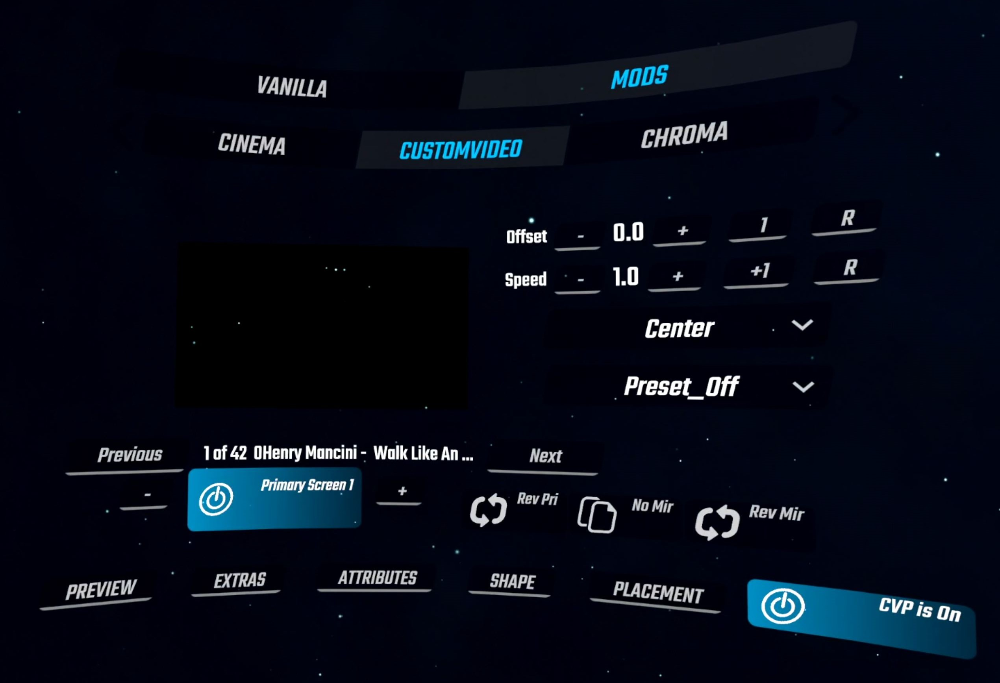
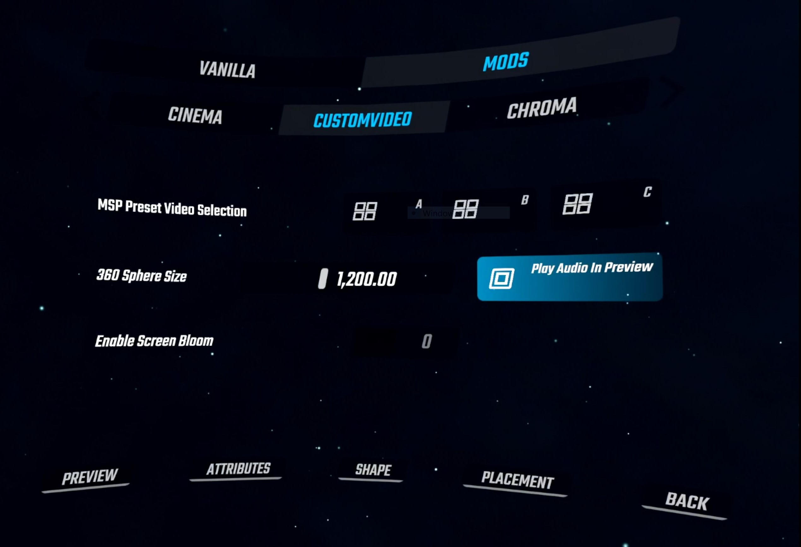
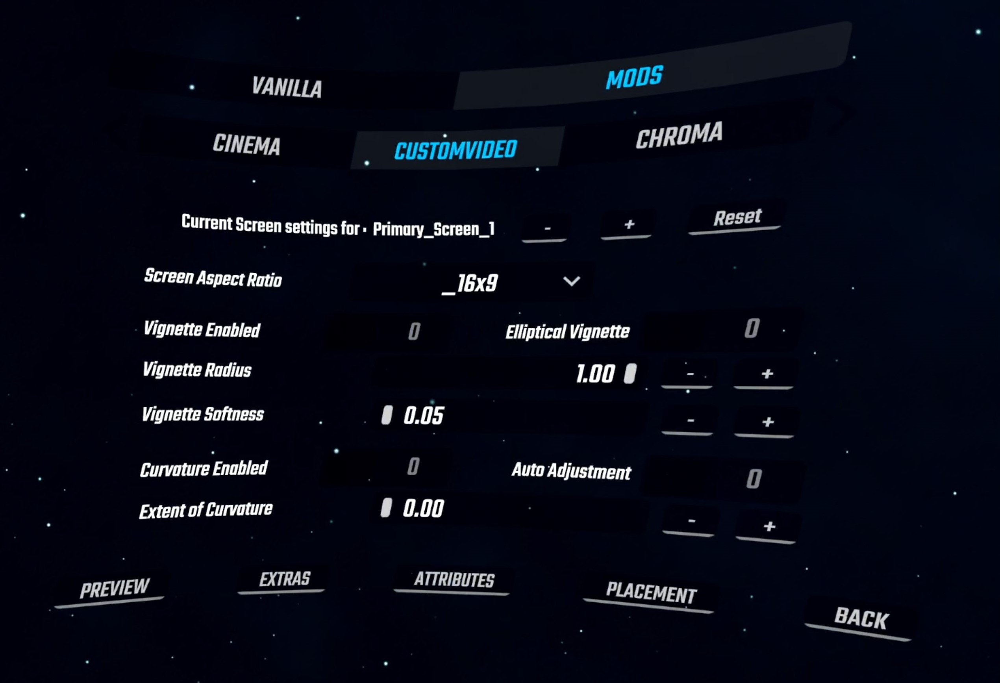
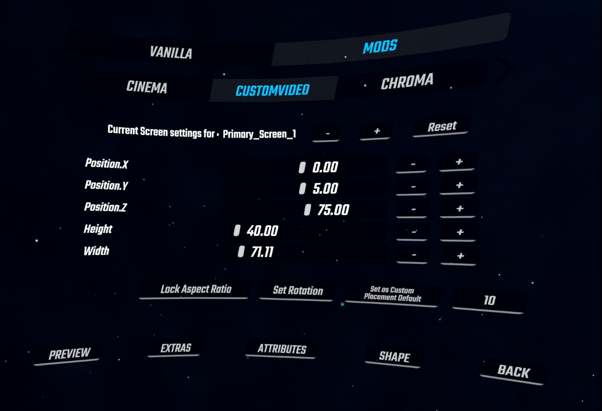

**What this is**

* CustomVideoPlayer is a Beat Saber addon created from a fork of the original MusicVideoPlayer mod.  It can work independently and alongside MVP or BeatSaberCinema.
* It plays videos from a CustomVideos directory.
* It allows you to: 
1. Play multiple videos at once.
2. Play 360 videos.
3. Use preset arrangements of screens using ‘Multiple Screen Placement’ (MSP) functionality.
* The benefits of this mod improve as one collects more videos and discovers creative ways to layer them or let them interact with the platform.

**Caveats**

* Does not import map's local video.  This feature was removed to make it less dependent on other mods and more future proof.
* The timing offset setting for the MSP presets is based on the timing offset of the video currently selected by the MSP controller screen.  This is by design to reduce the number of coroutines and improve synchronization when the MSP is used to 'uncrop' a higher definition image.
* The preset called P4_4x4 which is used to recreate an 8k image (or just show 16 videos) uses more screens than the MSP controller has access to.  Special rules apply if it is selected.  It can only be used by MSP_A.  If used it will disable MSP_B.
* The introduction of the bloom effect will cause issues for screens with large surface areas.  
* The screen color can be set to mimic either the cube(saber) or environment light colors.  This feature only works when the player overrides the default environment colors or when the colors are provided by the level map.  The functionality does not yet support the default environment colors, maps that envoke boost color events, or maps that use chroma.
* Placement editing for MSP screens is not possible.

**Feature List**

* Multiple Screens: Ability to play multiple videos simultaneously.
* 360 Screen:  The mod accepts monoscopic equirectangular 360 videos.  Two 360 videos can be played alongside the primary or MSP screens.  Screen radius can be dynamically resized using a slider control in the Extras Menu.
* Multi Screen Placement Presets: Several screens can be configured using the parameters associated with a single screen.  A UI dropdown list is used to select from several preset screen arrangements.  This is useful to quickly create environments suited for 90/360 maps and to allow higher resolution videos.
* Hide/Show screen body:  This creates screen transparency. 
* Video offset control:  Just like the original mod, a timing offset is associated with each video.
* Video speed control:  There is a video playback speed control that is a property associated with each screen.
* User defined screen placement:  Custom screen placement has returned and is configurable in CustomVideoPlayer.ini.
* Video color attribute control:  The following properties can be adjusted: Saturation, Contrast, Exposure, Hue, Gamma, Brightness.  
* Screen shape control:  Screen curvature and video vignetting can be adjusted.
* Screen placement:  The six primary screens can be adjusted by scale, position, rotation, and aspect ratio.
* Screen mirroring:  Each of the primary screens can be cloned and then mimicked across a given access.  This makes it easy to set up two screens with duplicate color and shape attributes.
* Screen image reversal: Each of the primary screens as well as the primary screen reflections can have their images reversed.  This allows the user more flexibility to find creative ways and produce symmetry throughout the play area.

**Things Missing**

* Youtube download functionality.  
* Ability to delete videos.
* Video offsets are currently not saved between sessions.
* Rolling Offset.  This was a feature in a previous version that would play a video from where it ended during the last play session.
* Rolling Video Queue.  This would automatically play the next video in the CustomVideos directory at each level restart.
* Pond mirroring.  This was an option from a previous version that placed a screen below the original to reflect the image.  True perspective projection was not properly achieved however and the introduction of screen placement editing broke the algorithm.

**CustomVideoPlayer, MusicVideoPlayer, AND BeatSaberCinema mod!**

* I created this mod as a branch of Rolo's MVP mod with the intention of just hardcoding the video path to a location other than the map level's directory.
* The branch was used (and still is) as a testbed for new ideas for using videos in the game.
* Dakari's BeatSaberCinema mod introduced a ton of features such as curved screens and vignetting to the mix.
* I have begun consolidating the mod by removing compatibility with MVP videos and dropping several features that were underutilitized.
* The progression of branching off of one mod and adding/deleting functionality has led to a very messy and bloated codebase.  I plan to reorganize the code for readability and trim out deprecated code fragments in the near future.
* A great deal of thanks goes to the mysterious and almighty Rolo who created the original MVP and to Rie Kumar, BRad, and Dakari for their mods.  

**Mod Requirements:**

Video files must be pre installed by the user in the following directories:

    Beat Saber/CustomVideos
    Beat Saber/CustomVideos/360
    Beat Saber/CustomVideos/VideoSets    (Optional)

Prerequisite Mods:

    BS Utils v1.8.0
    BeatSaberMarkupLanguage: v1.5.2
    BSIPA: v4.1.6
	SongCore v3.2.2

Videos must have an .mp4 extension.  Other extensions (.mkv, .mov, avi) will not be recognized. 
Videos with more advanced codecs will not work.  I haven't been able to get Unity to recognise the AV1 codec.  

  AV1 : AOMedia's AV1 Video (av01) doesn't work
  AVC : H264 - MPEG-4 AVC (part10) (avc1) works

The executables youtube-dl.exe and ffmpeg.exe were included in earlier releases but  CustomVideoPlayer no longer requires them to function.

CVP was tested on an Odyssey Plus HMD in WMR and on a Quest2 using Virtual Desktop.  System specs: 6700k / 2070s / 16GB  and Windows 10.  The performance and stability of gameplay will set the limit to how many videos should be allowed to play simultaneously.

**Main Menu:**
 

These are the necessary steps needed to configure this mod:  (*Essential steps in bold*)

1. **Turn CVP on**.  

2. **Select a screen** using (-/+).  
* For basic single screen placement choose any of the six primary screens.  

* For multi-screen placement, choose MSP A, B, or C.  

* For 360 videos, choose 360 Video Screen.
3. **Enable** that screen.  (In version 1.13.4, the screen button will be highlighted in blue.)

4. **Choose a screen placement or MSP preset**.
* For primary screens use the top dropdown list “Primary Screen Placement”

* For MSP screens use the lower dropdown list “Multi-Screen Placement”*

* For the 360 screen there is no placement, but the radius can be controlled by a slider in the Extras menu.
5. **Choose a video** using (Previous/Next).


Optional parameters: Speed, Offset, Primary Screen Image Reversed, Screen Mirrored X/Y/Z, Mirror Screen Image Reversed.

- 'Rev Pri' - This will reverse the image of the video for currently selected Primary Screen.

- 'No Mir/Mirror X/Mirror Y/Mirror Z' - This will create a second screen with the same parameters as the current screen (Primary screens only) and place it across the x, y, or z axis.  Mirroring x will place it left/right.  Mirroring Y will place it top/bottom.  Mirroring Z will place it front/back (good for 360 maps).

- 'Rev Mir' - This will reverse the image of the second mirrored (cloned) screen, if enabled.  This helps to add symmetry and adds flexiblity for creating interesting screen configurations.
   
    *(note:  If using MSP A/B/C, decide if a single video is repeated or if multiple videos will play in a sequence using the UI elements in Extras Menu.)


**Extras Menu:**
 

UI elements in the Extras menu:

- 'Multi Screen Sequence Bool' - if set, the screens controlled by the MSP screen will display a sequence of videos by their order in the video list.  Otherwise, a single video is repeated.

- 360 Sphere Size - If other mods have features in the periphery of the platform, setting the 360 sphere size can control which mod appears visible.  It will also change how the 360 screen interacts with other huge screen sizes playing within this mod.

- Play Audio In Preview - User can choose to play or mute audio during video preview.

- Enable Screen Bloom - Globally Enable/Disable screen bloom.


**Screen Attributes Menu:**
 

UI elements in the Screen Attributes Menu menu:

- 'Screen Selection' - Determines which screen the attributes are applied to.

- Reset - Resets values to default

- Transparent Screen - Hides the screen body creating transparency.

- Screen Color - Analogous to adding a colored filter to the lens of a camera.  Can be used effectively to alter videos to compliment the lasers/bricks used in the scene.  This works similarily to changes in the 'hue' value but works with much more drastic effect.  The hue value also does not alter black/white videos in any way.

- Color correction attributes : Contrast, Saturation, Exposure, Gamma, Hue, Brightness

- Set Bloom Intensity : This will adjust amount of bloom effect.  The intensity of this effect will increase with screen size.


**Screen Shapes Menu:**
 

UI elements in the Screen Shapes menu:

- 'Screen Selection' - Determines which screen the attributes are applied to.  It should be noted that while the 360 screens are selectable, none of the adjustments in the shapes menu affect them.

- Reset - Resets values to default

- Aspect Ratio - Dropdown list selects screen default aspect ratio.  If the aspect ratio is edited using controls in the placement menu, that value will be used to set screen dimension.  If the user resets screen placement values, the default aspect ratio will be restored the setting of this dropdown list.

- Screen Vignette controls - Enables/disables vignetting.  The shape can be toggled between elliptical and rectangular.  The radius and softness can be adjusted.  Softness of zero removes vignetting completely while a larger number has significant effect.  

- Screen Curvature controls - Enables/disables screen curvature.  The 'Auto-Adjustment' bool calculates the degree of curvature from the distance from the origin of the scene.  The manual adjustment slider will be applied if 'auto' is disabled.


**Screen Placement Menu:**
 
 
 UI elements in the Screen Placement menu:

- 'Screen Selection' - Determines which screen the placement settings are adjusting.

- Reset - Resets values to default

- Position.X/Rotaion.X - Changing Position.X axis move the screen left or right.  Changing Rotation.X rotates the screen so that the top/bottom move closer/further from the player.  This is the rotation used for the 'slanted' screen presets.

- Position.Y/Rotaion.Y - Changing Position.Y axis move the screen up or down.  Changing Rotation.Y rotates the screen so that the left/right edges move closer/further from the player.  This is the rotation used to force left/right presets to face the player.

- Position.Z/Rotaion.Z - Changing Position.Z axis move the screen closer or further away.  Changing Rotation.Z rotates the screen clockwise and counter clockwise.

- Height - Controls screen height.  When aspect ratio is locked, this slider will also effect screen width.

- Width - Controls screen width.  When aspect ratio is locked, this slider will be disabled.

- Lock/Unlock Aspect Ratio - toggle aspect ratio locking.

- Toggle Position/Rotation controls - This repurposes the position slider controls to act as rotational slider controls.  This just helps to save menu space.

- Set as Custom Placement Default - This will copy the current screen size/placement to the default 'Custom' placement setting, which is accessible in the 'Primary Screen Placement' dropdown list found on the main menu.  It also saves it in the CustomVideoPlayer.ini mod settings file found in the [Beat Saber/UserData] directory.

- Set -,+ step size - Adjust the amount the -,+ will affect the slider values.  The step size can be 10 , 1, 0.1, 0.01.


**Primary Screens:**

There are six primary screens which can be configured with their own set of parameters.   The upper dropdown list is used for these screens exclusively.  The UI does not do a very good job at getting this across so this may be a point of confusion.  If the user modifies the MSP preset list (lower dropdown list) while a primary screen is selected, the mod automatically changes the screen selection to the first open MSP screen.  Conversely, if the user changes a setting of the primary screen placement (upper dropdown list) while a MSP screen is selected, the mod will reselect to the first open primary screen.  This behavior can be used as a shortcut in configuring the UI but if it remains too confusing I may just disable the placement list which is not exclusive to the selected screen.

*Available Screen Placement Options:*

- *Standard view, vertical, front facing*
  
  - Center
  
  - Cinema
   
  - Back_Medium
  
  - Back_Huge

- *Slanted*
  
  - Slant_Small
  
  - Slant_Large

- *Left/Right*
  
  - Left_Small
  
  - Right_Small
  
  - Left_Medium
  
  - Right_Medium

- *Floor/Ceiling*
  
  - Floor_Medium
  
  - Floor_H90, Floor_H360       (Feet level for 90, 360 maps)
  
  - Ceiling_Medium
  
  - Ceiling_H90, Ceiling_H360   (Compliments Floor H90,360 arrangement)     

- *Special*
  
  - Pedestal
  
  - Custom     (User configured in CustomVideoPlayer.ini)

**MSP Screens:**

The idea of ‘multi-screen placement’ presets began when I wanted to create arrangements of videos exclusively for 90/360 maps.  In the beginning there were just two presets; one with four screens (90) and one with eight (360).  I then started playing with 4K videos cropped into 4 parts and then played back as one.  The idea evolved to include 3k videos (5760 x 1080) which I created from slideshows of desktop wallpaper associated with 3 monitor setups.  Although it is a bit over the top, I included 6k and 8k videos as well.  I’ve found that if the videos were 30fps, my current 6700k/2070s setup can handle up to around 20 videos before they begin to lag.  Although it can take a while to preprocess these videos, the action is fairly simple using a single batch file and the ffmpeg utility.  I will provide the batch file and a step by step explanation below.

* The current Multi Screen Placement List:
  
  (Note: Many of the screen placement settings are exclusive to MSP presets, otherwise it would overwhelm the primary placement ui list)
1. P1_4Screens  
   
   - Standard or 90 gameplay.
   - 4 screens - Center, Slant_Small, NorthWest, NorthEast

2. P2 1x3
   
   - 3K videos (5760x1080) - Front facing orientation.
   - 3 screens - Center_Left, Center, Center_Right

3. P3_2x2_Medium, P3_2x2_Large, P3_2x2_Huge
   
   - 4k videos (3840x2160) - Front facing orientation.
   - 4 screens - Back_4k_(M,L,H)_1-4

4. P4_3x3, P4_4x4
   
   - 6k (5760x3240), 8k (7680x4320) videos - Front facing orientation.
   - 9 and 16 screens.
     (Note: Since 6k isn’t a typical resolution, I just selectively cropped an 8k video)

5. P5_2x2_Slant
   
   - 4k, 4 screens, slanted 

6. P6_2x2_Floor_M, P6_2x2_Floor_H90, P6_2x2_Floor_H360, P6_2x2_Ceiling_H90, P6_2x2_Ceiling_H360
   
   - 4K, 4 screens, Medium floor placing suitable for normal gameplay
   - Huge floor placed just above (0.01) pedestal floor.  Rotated 180°.

7. P7_Hexagon, P7_Ocatagon
   
   - 6 or 8 screens.  Screens placed in a circle formation.  Suited for 360 maps.

8. P8_360_Cardinal_H, P8_360_Ordinal_H
   
   - 4 screens (Larger than those in P7)  Cardinal configuration puts screens at major compass points (North, South, East, West).
   - Ordinal setting locates screens at minor compass points (NorthEast, SouthEast, NorthWest, SouthWest)

**Screen Mirroring:**

Each of the primary screens can be cloned and represented across each of the x, y, and z axes.  This makes it easy to create scene symmetry while adding multiple color and shape property changes.  Mirroring across the X axis (Mirror_X) will create a left/right pair.  The selection of Mirror_Y is suitable for floor/ceiling arrangements.  Finally, using Mirror_Z will create a front/back pair suited for 360 maps.  In early testing, experiments using overlapping videos with lasers and kaleidoscopes have produced some cool results.

Screen mirroring only works for primary screens.


**360 Videos:**

There is currently two screens dedicated to 360 videos.  Only monoscopic equirectangular type videos will work.  I have been using the youtube-dl.exe utility in a DOS command shell to get these from Youtube.  Here is the structure of that command:

*C:\temp>youtube-dl.exe -f bestvideo[ext=mp4] --user-agent '' URL*

The videos need to be of type .mp4 and should be placed in the following directory:

*Beat Saber/CustomVideos/360*

**Higher Definition Videos:**

Until Unity starts using more advanced codecs for its video player, files larger than 1080p resolution cause issues.  For Windows 7 users, MPEG-4 maxes out at that size.  I have been able to play 4k MPEG-4’s but things start to lag when playing more than two.  I don’t think hardware acceleration was being utilized but that always brings up the problem with platform compatibility.  To circumvent this, I implemented 2x2 arrangements of 1080p videos using MSP presets recreating the original 4k video.   The MSP presets stitch the videos from left to right in the following arrangement:

    1    2
    3    4

The ffmpeg.exe utility makes cropping very easy but requires some patience.  Here are the batch file commands I used:

```
rem -- Convert to mkv if mp4
ffmpeg -i %1.mp4 -codec copy %1.mkv

rem -- remove sound
ffmpeg -i %1.mkv -vcodec copy -an  %1_ns.mkv

rem -- crop into 4 parts
ffmpeg -i %1_ns.mkv -filter:v "crop=1920:1080:0:0" %1_1.mkv
ffmpeg -i %1_ns.mkv -filter:v "crop=1920:1080:1920:0" %1_2.mkv
ffmpeg -i %1_ns.mkv -filter:v "crop=1920:1080:0:1080" %1_3.mkv
ffmpeg -i %1_ns.mkv -filter:v "crop=1920:1080:1920:1080" %1_4.mkv

rem -- convert to mp4
ffmpeg -i %1_1.mkv -c copy -map 0 %1_4k_1.mp4
ffmpeg -i %1_2.mkv -c copy -map 0 %1_4k_2.mp4
ffmpeg -i %1_3.mkv -c copy -map 0 %1_4k_3.mp4
ffmpeg -i %1_4.mkv -c copy -map 0 %1_4k_4.mp4

del %1_*.mkv
```

To crop different resolutions like 3k, 6k, and 8k, I altered the parameters appropriately and added a menu.  I’ll paste this at the end of this document.

Once a video is cropped into parts, the associated file names should allow it to retain its order alphabetically in relation to your other videos.  The videos can be accessed by putting them in the following folder:

 *Beat Saber/CustomVideos*

Alternatively, they can be put in their own folder by creating the subfolder “VideoSets” in the CustomVideo folder.  If this folder exists, the mod will search recursively and find all .mp4 videos in any subfolders.  With this arrangement, the sets are ensured to retain their proper order in the video list.

 *Beat Saber/CustomVideos/VideoSets/AnyName1*

 *Beat Saber/CustomVideos/VideoSets/AnyName2*

**Under the hood (for devs):**

- The preview screen retains the same code scheme as the original MVP mod.  It no longer has multiple duties though as it did prior.  It is now refered to as screencontroller[0].

- The methods and coroutines for the rest of screens follow a different path.  For anyone unfamiliar with the original code arrangement, this knowledge may help clear up what may seem like arbitrary design decisions.

** Version History **


**Added to Version 2.33**

* Added 'Reverse Image' capability for both Primary Screens and their reflection (if enabled).  The property is not transitive ... if you reverse both, the reflection will not be the original image, both will be the reversed.  Removed 'Rolling Video Queue' functionality by removing UI button.  Removed local video access by removing 'Source Priority' button.

**Added to Version 2.32**

* Fixed min/max values for rotational sliders in placement menu.  Added extra 'hoverhint' messages for 'Primary Placement' and 'Aspect Ratio' dropdown lists to warn that they will reset any changes made in the placement menu.  This is by design since these UI controls are essentially setting the default placement of the screen.

**Added to Version 2.31**

* Removed screen reflection and added mirroring across x, y, and z axes. Made the feature 'Primary screens only'. Multiple UI cosmetic changes.  Fixed all MSP (Multiple Screen Placement) screen positions.

**Added to Version 2.30**

* Added Screen Placement editor menu.  Changed CVP enable/disable button to a modifier for better menu uniformity and visibility.

**Added to Version 2.29**

* Added bloom global enable bool in 'Extras' menu.  Added Cinema screen location to placement list.  Fixed screen color routine to allow for maps with only left or right color initialization.

**Added to Version 2.28**

* Added screen bloom control to screen attributes menu.

**Added to Version 2.27**

* Updates for game version 1.13.4.  Added Environment and Cube(Saber) colors to screen dropdown list.

**Added to Version 2.26**

* Added screen curvature and screen color.  Game environment captures screen reflection properly.  Updated this readme file with new images.

**Added to Version 2.25**

* Added two submenus that process screen properties made accessible by the new Cinema shader.

**Added to Version 2.24**

* Changing from MVP shader to BeatSaberCinema shader.

**Added to Version 2.23**

* Changed menu screen position to work with Beat Saber v1.13.2.  Added a slider control in 'Extras' to set video screen brightness.

**Added to Version 2.22**

* Fixed a bug where the preview screen would appear in the main scene.  There is still a minor glitch where the preview is screen is sometimes invisible in the settings menu.  The screen will appear when the user interacts with the UI.

**Added to Version 2.21**

* Tweaked a couple reflection placement settings.

**Added to Version 2.2**

* Added a checkbox in 'Extras' menu that changes the way reflection screens work.  Type 1 reflections (bool unchecked) adds a screen to create either a mirror effect (vertical-horizontal) or between left-right, top-bottom.
  Type 2 reflections (bool checked) mirrors the screen behind the player (inverts x and z coordinates).
* Added another MSP (Multi-screen placement) preset for 6 screens in a hexagon shape.  This behaves similarly to the existing 8 screen octagon configuration.
* Removed reflection ability from Cardinal/Ordinal MSP presets.  These used to create a huge floor/ceiling.  Now that there are three MSP controller screens, creating a floor or ceiling can be done by just using another MSP.

**Added to Version 2.1**

* Ability to layer two 360 videos (Added second 360 video screen).
* Added additional MSP Controller screen for a total of three.
* New placements:  Floor/Ceiling H90.
  - The old Floor_H, Ceiling_H placement were unique because they put the video at floor level, which suited the 90/360 environments well.  The player was placed however in the center of the screen which was not ideal for 90 maps.
    I renamed the placements to Floor_H360, and Ceiling_H360 and added two complimentary configurations (H90) where the screen is in front of the player.


Here is the batch file I used to crop 3k, 4k, 6k, and 8k videos into separate 1080 parts.

```
echo on

rem make the video .mkv if .mp4
ffmpeg -i %2.mp4 -codec copy %2.mkv

if "%1" == "" goto instr
if "%1" == "?" goto instr
if "%1" == "3k" goto 3k
if "%1" == "4k" goto 4k
if "%1" == "6kc" goto 6kcentered
if "%1" == "8k" goto full8k
if "%1" == "8k2" goto 8k2

:instr

echo on
@echo command inputfile
@echo 3k = 3k
@echo 4k = 4k
@echo 6kc = 8k to 6k, fully centered
@echo 6kt = 8k to 6k, top and center justified
@echo 8k = full 8k
@echo 8k2 = 8k (2x2 4k)

goto endroutine

:3k

ffmpeg -i %2.mkv -vcodec copy -an  %2_ns.mkv
rem crop
ffmpeg -i %2_ns.mkv -filter:v "crop=1920:1080:0:0" %2_01.mkv
ffmpeg -i %2_ns.mkv -filter:v "crop=1920:1080:1920:0" %2_02.mkv
ffmpeg -i %2_ns.mkv -filter:v "crop=1920:1080:3840:0" %2_03.mkv

rem convert to mp4
ffmpeg -i %2_01.mkv -c copy -map 0 %2_3k_01.mp4
ffmpeg -i %2_02.mkv -c copy -map 0 %2_3k_02.mp4
ffmpeg -i %2_03.mkv -c copy -map 0 %2_3k_03.mp4

del %2_*.mkv 

goto endroutine

:6kcentered

rem Note: For 6k VideoSet, use first 6 for top aligned, last 6 for bottom.
rem fully center aligned
rem -000-
rem -000-
rem -000-
rem -000-
ffmpeg -i %2.mkv -vcodec copy -an  %2_ns.mkv

ffmpeg -i %2_ns.mkv -filter:v "crop=1920:1080:0960:540" %2_01.mkv
ffmpeg -i %2_ns.mkv -filter:v "crop=1920:1080:2880:540" %2_02.mkv
ffmpeg -i %2_ns.mkv -filter:v "crop=1920:1080:4800:540" %2_03.mkv
ffmpeg -i %2_ns.mkv -filter:v "crop=1920:1080:0960:1620" %2_04.mkv
ffmpeg -i %2_ns.mkv -filter:v "crop=1920:1080:2880:1620" %2_05.mkv
ffmpeg -i %2_ns.mkv -filter:v "crop=1920:1080:4800:1620" %2_06.mkv
ffmpeg -i %2_ns.mkv -filter:v "crop=1920:1080:0960:2700" %2_07.mkv
ffmpeg -i %2_ns.mkv -filter:v "crop=1920:1080:2880:2700" %2_08.mkv
ffmpeg -i %2_ns.mkv -filter:v "crop=1920:1080:4800:2700" %2_09.mkv

ffmpeg -i %2_01.mkv -c copy -map 0 %2_6k_1.mp4
ffmpeg -i %2_02.mkv -c copy -map 0 %2_6k_2.mp4
ffmpeg -i %2_03.mkv -c copy -map 0 %2_6k_3.mp4
ffmpeg -i %2_04.mkv -c copy -map 0 %2_6k_4.mp4
ffmpeg -i %2_05.mkv -c copy -map 0 %2_6k_5.mp4
ffmpeg -i %2_06.mkv -c copy -map 0 %2_6k_6.mp4
ffmpeg -i %2_07.mkv -c copy -map 0 %2_6k_7.mp4
ffmpeg -i %2_08.mkv -c copy -map 0 %2_6k_8.mp4
ffmpeg -i %2_09.mkv -c copy -map 0 %2_6k_9.mp4
del %2_*.mkv 

goto endroutine


:4k


ffmpeg -i %2.mkv -vcodec copy -an  %2_ns.mkv
ffmpeg -i %2_ns.mkv -filter:v "crop=1920:1080:0:0" %2_1.mkv
ffmpeg -i %2_ns.mkv -filter:v "crop=1920:1080:1920:0" %2_2.mkv
ffmpeg -i %2_ns.mkv -filter:v "crop=1920:1080:0:1080" %2_3.mkv
ffmpeg -i %2_ns.mkv -filter:v "crop=1920:1080:1920:1080" %2_4.mkv

ffmpeg -i %2_1.mkv -c copy -map 0 %2_4k_1.mp4
ffmpeg -i %2_2.mkv -c copy -map 0 %2_4k_2.mp4
ffmpeg -i %2_3.mkv -c copy -map 0 %2_4k_3.mp4
ffmpeg -i %2_4.mkv -c copy -map 0 %2_4k_4.mp4
del %2_*.mkv 

IF [%3] == [] GOTO endroutine
ffmpeg -i %3.mp4 -codec copy %3.mkv
ffmpeg -i %3.mkv -vcodec copy -an  %3_ns.mkv
ffmpeg -i %3_ns.mkv -filter:v "crop=1920:1080:0:0" %3_1.mkv
ffmpeg -i %3_ns.mkv -filter:v "crop=1920:1080:1920:0" %3_2.mkv
ffmpeg -i %3_ns.mkv -filter:v "crop=1920:1080:0:1080" %3_3.mkv
ffmpeg -i %3_ns.mkv -filter:v "crop=1920:1080:1920:1080" %3_4.mkv

ffmpeg -i %3_1.mkv -c copy -map 0 %3_4k_1.mp4
ffmpeg -i %3_2.mkv -c copy -map 0 %3_4k_2.mp4
ffmpeg -i %3_3.mkv -c copy -map 0 %3_4k_3.mp4
ffmpeg -i %3_4.mkv -c copy -map 0 %3_4k_4.mp4
del %3_*.mkv 


goto endroutine

:full8k
rem 8K = 7,680x4,320
rem full 8k
rem oooo
rem oooo
rem oooo
rem oooo
ffmpeg -i %2.mkv -vcodec copy -an  %2_ns.mkv
rem crop
ffmpeg -i %2_ns.mkv -filter:v "crop=1920:1080:0:0" %2_01.mkv
ffmpeg -i %2_ns.mkv -filter:v "crop=1920:1080:1920:0" %2_02.mkv
ffmpeg -i %2_ns.mkv -filter:v "crop=1920:1080:3840:0" %2_03.mkv
ffmpeg -i %2_ns.mkv -filter:v "crop=1920:1080:5760:0" %2_04.mkv
ffmpeg -i %2_ns.mkv -filter:v "crop=1920:1080:0:1080" %2_05.mkv
ffmpeg -i %2_ns.mkv -filter:v "crop=1920:1080:1920:1080" %2_06.mkv
ffmpeg -i %2_ns.mkv -filter:v "crop=1920:1080:3840:1080" %2_07.mkv
ffmpeg -i %2_ns.mkv -filter:v "crop=1920:1080:5760:1080" %2_08.mkv
ffmpeg -i %2_ns.mkv -filter:v "crop=1920:1080:0:2160" %2_09.mkv
ffmpeg -i %2_ns.mkv -filter:v "crop=1920:1080:1920:2160" %2_10.mkv
ffmpeg -i %2_ns.mkv -filter:v "crop=1920:1080:3840:2160" %2_11.mkv
ffmpeg -i %2_ns.mkv -filter:v "crop=1920:1080:5760:2160" %2_12.mkv
ffmpeg -i %2_ns.mkv -filter:v "crop=1920:1080:0:3240" %2_13.mkv
ffmpeg -i %2_ns.mkv -filter:v "crop=1920:1080:1920:3240" %2_14.mkv
ffmpeg -i %2_ns.mkv -filter:v "crop=1920:1080:3840:3240" %2_15.mkv
ffmpeg -i %2_ns.mkv -filter:v "crop=1920:1080:5760:3240" %2_16.mkv

rem convert to mp4
ffmpeg -i %2_01.mkv -c copy -map 0 %2_8k_01.mp4
ffmpeg -i %2_02.mkv -c copy -map 0 %2_8k_02.mp4
ffmpeg -i %2_03.mkv -c copy -map 0 %2_8k_03.mp4
ffmpeg -i %2_04.mkv -c copy -map 0 %2_8k_04.mp4
ffmpeg -i %2_05.mkv -c copy -map 0 %2_8k_05.mp4
ffmpeg -i %2_06.mkv -c copy -map 0 %2_8k_06.mp4
ffmpeg -i %2_07.mkv -c copy -map 0 %2_8k_07.mp4
ffmpeg -i %2_08.mkv -c copy -map 0 %2_8k_08.mp4
ffmpeg -i %2_09.mkv -c copy -map 0 %2_8k_09.mp4
ffmpeg -i %2_10.mkv -c copy -map 0 %2_8k_10.mp4
ffmpeg -i %2_11.mkv -c copy -map 0 %2_8k_11.mp4
ffmpeg -i %2_12.mkv -c copy -map 0 %2_8k_12.mp4
ffmpeg -i %2_13.mkv -c copy -map 0 %2_8k_13.mp4
ffmpeg -i %2_14.mkv -c copy -map 0 %2_8k_14.mp4
ffmpeg -i %2_15.mkv -c copy -map 0 %2_8k_15.mp4
ffmpeg -i %2_16.mkv -c copy -map 0 %2_8k_16.mp4

del %2_*.mkv 
goto endroutine

:8k2
rem Crops an 8k video into 4 4k Videos.
rem Note:  Still too much to chew using 6700k/2070s
rem 8K = 7,680x4,320
rem 8k2 (2x2)

ffmpeg -i %2.mkv -vcodec copy -an  %2_ns.mkv
rem crop
ffmpeg -i %2_ns.mkv -filter:v "crop=3840:2160:0:0" %2_01.mkv
ffmpeg -i %2_ns.mkv -filter:v "crop=3840:2160:3840:0" %2_02.mkv
ffmpeg -i %2_ns.mkv -filter:v "crop=3840:2160:0:2160" %2_03.mkv
ffmpeg -i %2_ns.mkv -filter:v "crop=3840:2160:3840:2160" %2_04.mkv


rem convert to mp4
ffmpeg -i %2_01.mkv -c copy -map 0 %2_8k_01.mp4
ffmpeg -i %2_02.mkv -c copy -map 0 %2_8k_02.mp4
ffmpeg -i %2_03.mkv -c copy -map 0 %2_8k_03.mp4
ffmpeg -i %2_04.mkv -c copy -map 0 %2_8k_04.mp4


del %2_*.mkv 
goto endroutine

:endroutine
```
