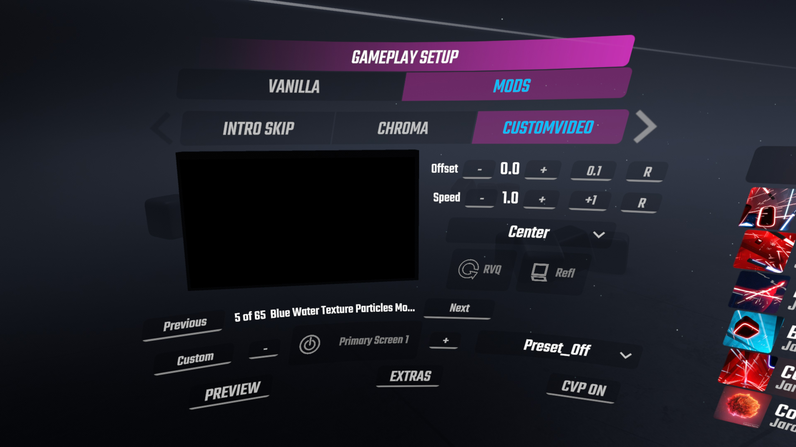
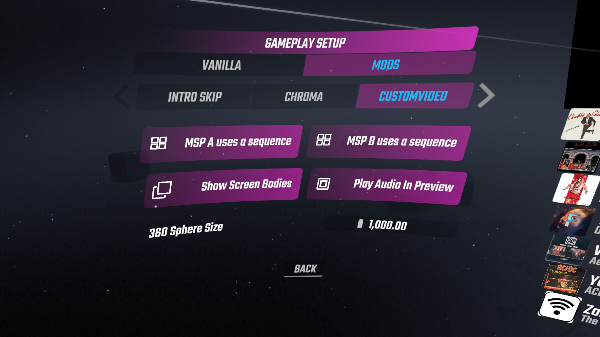

**What this is**

* CustomVideoPlayer is a Beat Saber addon created from a fork of the original MusicVideoPlayer mod.  It can work independently and alongside MVP.
* It plays videos from a CustomVideo directory as well from a map’s local directory.
* It extends MVP’s functionality with three added features: 
1. Plays multiple videos at once.
2. Plays 360 videos.
3. Adds ‘Multiple Screen Placement’ (MSP) functionality with multiple preset combinations.
* The benefits of this mod improve as one collects more videos and discovers creative ways to layer them or let them interact with the platform.

**Feature List**

* Multiple Screens: Ability to play multiple videos simultaneously.
* 360 Screen:  The mod accepts monoscopic equirectangular 360 videos.  The video can be played alongside the primary or MSP screens.  Its radius can be dynamically resized using a slider control in the Extras Menu.
* Multi Screen Placement Presets: Several screens can be configured using the parameters associated with a single screen.  A UI dropdown list is used to select from several preset screen arrangements.  This is useful to quickly create environments suited for 90/360 maps and to allow higher resolution videos.  I will explain below.
* Screen reflection:  Each of the primary screens and most of the MSP configurations have reflection ability.  This attempts to create the effect similar to an image reflecting off of a pond.  Each primary and MSP screen orientation is handled a bit differently and will be described in more detail below.
* Hide/Show screen body:  There is normally a cube shaped feature attached to the 2D screen to give it a more distinct appearance.  This can now be toggled on and off.
* Rolling video queue:  Each primary and MSP screen can be set to automatically increment the video queue after each game play.
* Video offset control:  Just like the original mod, a timing offset is associated with each video.
* Video speed control:  There is a video playback speed control that is a property associated with each screen.
* User defined screen placement:  Custom screen placement has returned and is configurable in CustomVideoPlayer.ini.

**Things Missing**

* Youtube download functionality.  
* Ability to delete videos.
* Video offsets are currently not saved between sessions.
* Rolling Offset.  This was a feature in a previous version that would play a video from where it ended during the last play session.

**CustomVideos mod and MusicVideoPlayer mod**

* Since the CV mod is just a branch of MVP it shares a common framework.
* Up until recently, all of the features of MVP were present in CV but there was overlap which created resource allocation problems during initialization and termination of the two mods when both were installed.
* I created this version, which I termed CVLite during development so that I could pay attention to adding new features and allow both mods to behave independently.
* CV will recognize the new json file format used by BRad’s current MVP mod.  
* If several local videos are allocated locally to a map, CV will allow the user to play them all simultaneously.  
* A great deal of thanks goes to the mysterious and almighty Rolo who created this mod and to Rie Kumar, BRad and others who have maintained it.  

**Mod Requirements:**

Video files must be pre installed by the user in the following directories:

    Beat Saber/CustomVideos
    Beat Saber/CustomVideos/360
    Beat Saber/CustomVideos/VideoSets    (Optional)

Prerequisite Mods:

    BS Utils: 1.5.0
    BeatSaberMarkupLanguage: 1.3.5
    BSIPA: 4.1.3

Videos with more advanced codecs will not work.  I haven't been able to get Unity to recognise the AV1 codec.  

  AV1 : AOMedia's AV1 Video (av01) doesn't work
  AVC : H264 - MPEG-4 AVC (part10) (avc1) works

The executables youtube-dl.exe and ffmpeg.exe were included in earlier releases but  CustomVideoPlayer no longer requires them to function.

CVP was tested on an Odyssey Plus HMD in WMR and on a Quest2 using Virtual Desktop.  System specs: 6700k / 2070s / 16GB  and Windows 10.  The performance and stability of gameplay will set the limit to how many videos should be allowed to play simultaneously.

**The UI:**

 

These are the necessary steps needed to configure this mod:  (*Essential steps in bold*)

1. **Turn CVP on**.  

2. **Select a screen** using (-/+).  
* For basic single screen placement choose any of the six primary screens.  

* For multi-screen placement, choose MSP A or B.  

* For 360 videos, choose 360 Video Screen.
3. **Enable** that screen.  (In version 12.1, the screen button will be highlighted in pink.)

4. **Choose a screen placement or MSP preset**.
* For primary screens use the top dropdown list “Primary Screen Placement”

* For MSP screens use the lower dropdown list “Multi-Screen Placement”

* For the 360 screen there is no placement, but the radius can be controlled by a slider in the Extras menu.
5. **Choose a video** using (Previous/Next).

6. Set optional screen parameters Speed, Offset, RVQ, Reflection Screen.
   
    (note:  If using MSP A or B, decide if a single video is repeated or if multiple videos will play in a sequence using the UI element in Extras Menu.)
   
   

<!--  -->

UI elements in the extras menu:

- 'Multi Screen Sequence Bool' - if set, the MSP screen will display a sequence of videos by their order in the video list.  Otherwise, a single video is repeated.

- Show Screen Bodies - The black cube that appears behind the 2D screen can be shown or hidden.

- Play Audio In Preview - User can choose to play or mute audio during video preview.

- 360 Sphere Size - If other mods have features in the periphery of the platform, setting the 360 sphere size can control which mod appears visible.  It will also change how the 360 screen interacts with other huge screen sizes playing within this mod.

**Primary Screens:**

There are six primary screens which can be configured with their own set of parameters.   The upper dropdown list is used for these screens exclusively.  The UI does not do a very good job at getting this across so this may be a point of confusion.  If the user modifies the MSP dropdown list while a primary screen is selected, the mod automatically changes the screen selection to the first open MSP screen (A or B).  Conversely, if the user changes a setting of the primary screen placement (upper dropdown list) while a MSP screen is selected, the mod will reselect to the first open primary screen.  This behavior can be used as a shortcut in configuring the UI but if it remains too confusing I may just disable the placement list which is not exclusive to the selected screen.

*Available Screen Placement Options:*

- *Standard view, vertical, front facing*
  
  - Center
  
  - Back_Medium
  
  - Back_Huge

- *Slanted*
  
  - Slant_Small
  
  - Slant_Large

- *Left/Right*
  
  - Left_Small
  
  - Right_Small
  
  - Left_Medium
  
  - Right_Medium

- *Floor/Ceiling*
  
  - Floor_Medium
  
  - Floor_Huge           (Feet level, 360 maps)
  
  - Ceiling_Medium
  
  - Ceiling_Huge        (360 maps)

- *Special*
  
  - Pedestal
  
  - Custom     (User configured in CustomVideoPlayer.ini)

**MSP Screens:**

The idea of ‘multi-screen placement’ presets began when I wanted to create arrangements of videos exclusively for 90/360 maps.  In the beginning there were just two presets; one with four screens (90) and one with eight (360).  I then started playing with 4K videos cropped into 4 parts and then played back as one.  The idea evolved to include 3k videos (5760 x 1080) which I created from slideshows of desktop wallpaper associated with 3 monitor setups.  Although it is a bit over the top, I included 6k and 8k videos as well.  I’ve found that if the videos were 30fps, my current 6700k/2070s setup can handle up to around 20 videos before they begin to lag.  Although it can take a while to preprocess these videos, the action is fairly simple using a single batch file and the ffmpeg utility.  I will provide the batch file and a step by step explanation below.

* The current Multi Screen Placement List:
  
  (Note: Many of the screen placement settings are exclusive to MSP presets, otherwise it would overwhelm the primary placement ui list)
1. P1_4Screens  
   
   - Standard or 90 gameplay.
   - 4 screens - Center, Slant_Small, NorthWest, NorthEast

2. P2 1x3
   
   - 3K videos (5760x1080) - Front facing orientation.
   - 3 screens - Center_Left, Center, Center_Right

3. P3_2x2_Medium, P3_2x2_Large, P3_2x2_Huge
   
   - 4k videos (3840x2160) - Front facing orientation.
   - 4 screens - Back_4k_(M,L,H)_1-4

4. P4_3x3, P4_4x4
   
   - 6k (5760x3240), 8k (7680x4320) videos - Front facing orientation.
   - 9 and 16 screens.
     (Note: Since 6k isn’t a typical resolution, I just selectively cropped an 8k video)

5. P5_2x2_Slant
   
   - 4k, 4 screens, slanted 

6. P6_2x2_Floor_M, P6_2x2_Floor_H, P6_2x2_Ceiling_H
   
   - 4K, 4 screens, Medium floor placing suitable for normal gameplay
   - Huge floor placed just above (0.01) pedestal floor.  Rotated 180°.

7. P7_8Scr_Ring
   
   - 8 screens.  Screens placed at all compass points.  Suited for 360 maps.

8. P8_360_Cardinal_H, P8_360_Ordinal_H
   
   - 4 screens (Larger than those in P7)  Cardinal configuration puts screens at major compass points (North, South, East, West).
   - Ordinal setting locates screens at minor compass points (NorthEast, SouthEast, NorthWest, SouthWest)

**Screen Reflection:**

This feature derives from an idea I had a long time ago but could not actuate until I learned how to reverse the uv elements of a 2D object.  It creates a mirror effect as if the video sits above a pond surface.  The overall concept was hit and miss depending on the type of video.  It was also very easy to implement when there were only a half dozen or so screen placement settings.  For many of the screen configurations, a reflection does not make sense and looks out of place.  In those arrangements, the reflection feature becomes a way to quickly enhance the screen setup process.  For floor placed screens, the reflection is on the ceiling, and visa versa.  For Left placed screens, the reflection is on the right.  For the pedestal and larger slant screens, the reflection is placed behind the original at a slightly larger size, creating a video frame.

The reflection concept works for both Primary and MSP screens with the following exceptions.

P8_360_Cardinal_H : The reflection screens create a 360 type floor  (P6_2x2_Floor_H)

P8_360_Ordinal_H : The reflection screens create a 360 type ceiling  (P6_2x2_Ceiling_H)

P4_3x3, P4_4x4 : Reflection isn’t activated.

**360 Videos:**

There is currently one screen dedicated to 360 videos.  Only monoscopic equirectangular type videos will work.  I have been using the youtube-dl.exe utility in a DOS command shell to get these from Youtube.  Here is the structure of that command:

*C:\temp>youtube-dl.exe -f bestvideo[ext=mp4] --user-agent '' URL*

The videos need to be of type .mp4 and should be placed in the following directory:

*Beat Saber/CustomVideos/360*

**Higher Definition Videos:**

Until Unity starts using more advanced codecs for its video player, files larger than 1080p resolution cause issues.  For Windows 7 users, MPEG-4 maxes out at that size.  I have been able to play 4k MPEG-4’s but things start to lag when playing more than two.  I don’t think hardware acceleration was being utilized but that always brings up the problem with platform compatibility.  To circumvent this, I implemented 2x2 arrangements of 1080p videos using MSP presets recreating the original 4k video.   The MSP presets stitch the videos from left to right in the following arrangement:

    1    2
    3    4

The ffmpeg.exe utility makes cropping very easy but requires some patience.  Here are the batch file commands I used:

```
rem -- Convert to mkv if mp4
ffmpeg -i %1.mp4 -codec copy %1.mkv

rem -- remove sound
ffmpeg -i %1.mkv -vcodec copy -an  %1_ns.mkv

rem -- crop into 4 parts
ffmpeg -i %1_ns.mkv -filter:v "crop=1920:1080:0:0" %1_1.mkv
ffmpeg -i %1_ns.mkv -filter:v "crop=1920:1080:1920:0" %1_2.mkv
ffmpeg -i %1_ns.mkv -filter:v "crop=1920:1080:0:1080" %1_3.mkv
ffmpeg -i %1_ns.mkv -filter:v "crop=1920:1080:1920:1080" %1_4.mkv

rem -- convert to mp4
ffmpeg -i %1_1.mkv -c copy -map 0 %1_4k_1.mp4
ffmpeg -i %1_2.mkv -c copy -map 0 %1_4k_2.mp4
ffmpeg -i %1_3.mkv -c copy -map 0 %1_4k_3.mp4
ffmpeg -i %1_4.mkv -c copy -map 0 %1_4k_4.mp4

del %1_*.mkv
```

To crop different resolutions like 3k, 6k, and 8k, I altered the parameters appropriately and added a menu.  I’ll paste this at the end of this document.

Once a video is cropped into parts, the associated file names should allow it to retain its order alphabetically in relation to your other videos.  The videos can be accessed by putting them in the following folder:

 *Beat Saber/CustomVideos*

Alternatively, they can be put in their own folder by creating the subfolder “VideoSets” in the CustomVideo folder.  If this folder exists, the mod will search recursively and find all .mp4 videos in any subfolders.  With this arrangement, the sets are ensured to retain their proper order in the video list.

 *Beat Saber/CustomVideos/VideoSets/AnyName1*
 *Beat Saber/CustomVideos/VideoSets/AnyName2*

**Under the hood (for devs):**

- The preview screen retains the same code scheme as the original MVP mod.  It no longer has multiple duties though as it did prior.  It is now refered to as screencontroller[0].

- The methods and coroutines for the rest of screens follow a different path.  For anyone unfamiliar with the original code arrangement, this knowledge may help clear up what may seem like arbitrary design decisions.

- Hidden placement utility.  There is a hidden subroutine that can be turned on using a bool in VideoMenu.cs.  It changes the UI elements normally associated with the offset setting into controls that allow adjustment of a designated screen placement.  This was used to precision place the MSP preset screens.

- When I first tested this mod along side of MVP, it would hang during startup and termination of the game.  Both MVP and CVP competed for access of the local map's .json files.  I circumvented this by delaying the retrieval of local map data until the user request a local video by hitting the local/custom priority button.  I also removed persistence of the video offset value.

- I may publish a version with search functionality intact when I feel the other features are mature and bug free.

**On the roadmap:**

- Add another 360 video screen, which will allow the ability to layer that type of video.

- Add another MSP selection screen, for a total of 3.

- Add a screen placement editor in game and make more screen position values customizable and persistant.

- Add user customization of an MSP preset using CustomVideo.ini.

- Add 180 video capability.

Here is the batch file I used to crop 3k, 4k, 6k, and 8k videos into separate 1080 parts.

```
echo on

rem make the video .mkv if .mp4
ffmpeg -i %2.mp4 -codec copy %2.mkv

if "%1" == "" goto instr
if "%1" == "?" goto instr
if "%1" == "3k" goto 3k
if "%1" == "4k" goto 4k
if "%1" == "6kc" goto 6kcentered
if "%1" == "8k" goto full8k
if "%1" == "8k2" goto 8k2

:instr

echo on
@echo command inputfile
@echo 3k = 3k
@echo 4k = 4k
@echo 6kc = 8k to 6k, fully centered
@echo 6kt = 8k to 6k, top and center justified
@echo 8k = full 8k
@echo 8k2 = 8k (2x2 4k)

goto endroutine

:3k

ffmpeg -i %2.mkv -vcodec copy -an  %2_ns.mkv
rem crop
ffmpeg -i %2_ns.mkv -filter:v "crop=1920:1080:0:0" %2_01.mkv
ffmpeg -i %2_ns.mkv -filter:v "crop=1920:1080:1920:0" %2_02.mkv
ffmpeg -i %2_ns.mkv -filter:v "crop=1920:1080:3840:0" %2_03.mkv

rem convert to mp4
ffmpeg -i %2_01.mkv -c copy -map 0 %2_3k_01.mp4
ffmpeg -i %2_02.mkv -c copy -map 0 %2_3k_02.mp4
ffmpeg -i %2_03.mkv -c copy -map 0 %2_3k_03.mp4

del %2_*.mkv 

goto endroutine

:6kcentered

rem Note: For 6k VideoSet, use first 6 for top aligned, last 6 for bottom.
rem fully center aligned
rem -000-
rem -000-
rem -000-
rem -000-
ffmpeg -i %2.mkv -vcodec copy -an  %2_ns.mkv

ffmpeg -i %2_ns.mkv -filter:v "crop=1920:1080:0960:540" %2_01.mkv
ffmpeg -i %2_ns.mkv -filter:v "crop=1920:1080:2880:540" %2_02.mkv
ffmpeg -i %2_ns.mkv -filter:v "crop=1920:1080:4800:540" %2_03.mkv
ffmpeg -i %2_ns.mkv -filter:v "crop=1920:1080:0960:1620" %2_04.mkv
ffmpeg -i %2_ns.mkv -filter:v "crop=1920:1080:2880:1620" %2_05.mkv
ffmpeg -i %2_ns.mkv -filter:v "crop=1920:1080:4800:1620" %2_06.mkv
ffmpeg -i %2_ns.mkv -filter:v "crop=1920:1080:0960:2700" %2_07.mkv
ffmpeg -i %2_ns.mkv -filter:v "crop=1920:1080:2880:2700" %2_08.mkv
ffmpeg -i %2_ns.mkv -filter:v "crop=1920:1080:4800:2700" %2_09.mkv

ffmpeg -i %2_01.mkv -c copy -map 0 %2_6k_1.mp4
ffmpeg -i %2_02.mkv -c copy -map 0 %2_6k_2.mp4
ffmpeg -i %2_03.mkv -c copy -map 0 %2_6k_3.mp4
ffmpeg -i %2_04.mkv -c copy -map 0 %2_6k_4.mp4
ffmpeg -i %2_05.mkv -c copy -map 0 %2_6k_5.mp4
ffmpeg -i %2_06.mkv -c copy -map 0 %2_6k_6.mp4
ffmpeg -i %2_07.mkv -c copy -map 0 %2_6k_7.mp4
ffmpeg -i %2_08.mkv -c copy -map 0 %2_6k_8.mp4
ffmpeg -i %2_09.mkv -c copy -map 0 %2_6k_9.mp4
del %2_*.mkv 

goto endroutine


:4k


ffmpeg -i %2.mkv -vcodec copy -an  %2_ns.mkv
ffmpeg -i %2_ns.mkv -filter:v "crop=1920:1080:0:0" %2_1.mkv
ffmpeg -i %2_ns.mkv -filter:v "crop=1920:1080:1920:0" %2_2.mkv
ffmpeg -i %2_ns.mkv -filter:v "crop=1920:1080:0:1080" %2_3.mkv
ffmpeg -i %2_ns.mkv -filter:v "crop=1920:1080:1920:1080" %2_4.mkv

ffmpeg -i %2_1.mkv -c copy -map 0 %2_4k_1.mp4
ffmpeg -i %2_2.mkv -c copy -map 0 %2_4k_2.mp4
ffmpeg -i %2_3.mkv -c copy -map 0 %2_4k_3.mp4
ffmpeg -i %2_4.mkv -c copy -map 0 %2_4k_4.mp4
del %2_*.mkv 

IF [%3] == [] GOTO endroutine
ffmpeg -i %3.mp4 -codec copy %3.mkv
ffmpeg -i %3.mkv -vcodec copy -an  %3_ns.mkv
ffmpeg -i %3_ns.mkv -filter:v "crop=1920:1080:0:0" %3_1.mkv
ffmpeg -i %3_ns.mkv -filter:v "crop=1920:1080:1920:0" %3_2.mkv
ffmpeg -i %3_ns.mkv -filter:v "crop=1920:1080:0:1080" %3_3.mkv
ffmpeg -i %3_ns.mkv -filter:v "crop=1920:1080:1920:1080" %3_4.mkv

ffmpeg -i %3_1.mkv -c copy -map 0 %3_4k_1.mp4
ffmpeg -i %3_2.mkv -c copy -map 0 %3_4k_2.mp4
ffmpeg -i %3_3.mkv -c copy -map 0 %3_4k_3.mp4
ffmpeg -i %3_4.mkv -c copy -map 0 %3_4k_4.mp4
del %3_*.mkv 


goto endroutine

:full8k
rem 8K = 7,680x4,320
rem full 8k
rem oooo
rem oooo
rem oooo
rem oooo
ffmpeg -i %2.mkv -vcodec copy -an  %2_ns.mkv
rem crop
ffmpeg -i %2_ns.mkv -filter:v "crop=1920:1080:0:0" %2_01.mkv
ffmpeg -i %2_ns.mkv -filter:v "crop=1920:1080:1920:0" %2_02.mkv
ffmpeg -i %2_ns.mkv -filter:v "crop=1920:1080:3840:0" %2_03.mkv
ffmpeg -i %2_ns.mkv -filter:v "crop=1920:1080:5760:0" %2_04.mkv
ffmpeg -i %2_ns.mkv -filter:v "crop=1920:1080:0:1080" %2_05.mkv
ffmpeg -i %2_ns.mkv -filter:v "crop=1920:1080:1920:1080" %2_06.mkv
ffmpeg -i %2_ns.mkv -filter:v "crop=1920:1080:3840:1080" %2_07.mkv
ffmpeg -i %2_ns.mkv -filter:v "crop=1920:1080:5760:1080" %2_08.mkv
ffmpeg -i %2_ns.mkv -filter:v "crop=1920:1080:0:2160" %2_09.mkv
ffmpeg -i %2_ns.mkv -filter:v "crop=1920:1080:1920:2160" %2_10.mkv
ffmpeg -i %2_ns.mkv -filter:v "crop=1920:1080:3840:2160" %2_11.mkv
ffmpeg -i %2_ns.mkv -filter:v "crop=1920:1080:5760:2160" %2_12.mkv
ffmpeg -i %2_ns.mkv -filter:v "crop=1920:1080:0:3240" %2_13.mkv
ffmpeg -i %2_ns.mkv -filter:v "crop=1920:1080:1920:3240" %2_14.mkv
ffmpeg -i %2_ns.mkv -filter:v "crop=1920:1080:3840:3240" %2_15.mkv
ffmpeg -i %2_ns.mkv -filter:v "crop=1920:1080:5760:3240" %2_16.mkv

rem convert to mp4
ffmpeg -i %2_01.mkv -c copy -map 0 %2_8k_01.mp4
ffmpeg -i %2_02.mkv -c copy -map 0 %2_8k_02.mp4
ffmpeg -i %2_03.mkv -c copy -map 0 %2_8k_03.mp4
ffmpeg -i %2_04.mkv -c copy -map 0 %2_8k_04.mp4
ffmpeg -i %2_05.mkv -c copy -map 0 %2_8k_05.mp4
ffmpeg -i %2_06.mkv -c copy -map 0 %2_8k_06.mp4
ffmpeg -i %2_07.mkv -c copy -map 0 %2_8k_07.mp4
ffmpeg -i %2_08.mkv -c copy -map 0 %2_8k_08.mp4
ffmpeg -i %2_09.mkv -c copy -map 0 %2_8k_09.mp4
ffmpeg -i %2_10.mkv -c copy -map 0 %2_8k_10.mp4
ffmpeg -i %2_11.mkv -c copy -map 0 %2_8k_11.mp4
ffmpeg -i %2_12.mkv -c copy -map 0 %2_8k_12.mp4
ffmpeg -i %2_13.mkv -c copy -map 0 %2_8k_13.mp4
ffmpeg -i %2_14.mkv -c copy -map 0 %2_8k_14.mp4
ffmpeg -i %2_15.mkv -c copy -map 0 %2_8k_15.mp4
ffmpeg -i %2_16.mkv -c copy -map 0 %2_8k_16.mp4

del %2_*.mkv 
goto endroutine

:8k2
rem Crops an 8k video into 4 4k Videos.
rem Note:  Still too much to chew using 6700k/2070s
rem 8K = 7,680x4,320
rem 8k2 (2x2)

ffmpeg -i %2.mkv -vcodec copy -an  %2_ns.mkv
rem crop
ffmpeg -i %2_ns.mkv -filter:v "crop=3840:2160:0:0" %2_01.mkv
ffmpeg -i %2_ns.mkv -filter:v "crop=3840:2160:3840:0" %2_02.mkv
ffmpeg -i %2_ns.mkv -filter:v "crop=3840:2160:0:2160" %2_03.mkv
ffmpeg -i %2_ns.mkv -filter:v "crop=3840:2160:3840:2160" %2_04.mkv


rem convert to mp4
ffmpeg -i %2_01.mkv -c copy -map 0 %2_8k_01.mp4
ffmpeg -i %2_02.mkv -c copy -map 0 %2_8k_02.mp4
ffmpeg -i %2_03.mkv -c copy -map 0 %2_8k_03.mp4
ffmpeg -i %2_04.mkv -c copy -map 0 %2_8k_04.mp4


del %2_*.mkv 
goto endroutine

:endroutine
```
